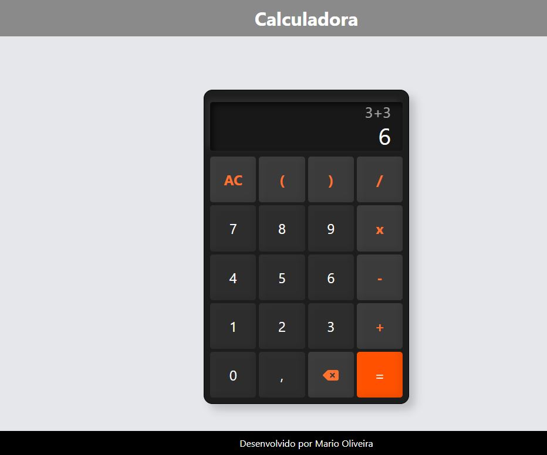

## 🧮 Calculadora em React


## 🔗 Acessar a Calculadora
[Calculadora](https://calculadore.weboliveira.top/)

Este é um projeto de uma calculadora simples desenvolvida com React.
Este é um projeto de uma calculadora simples desenvolvida com React como parte dos meus estudos em desenvolvimento front-end. O objetivo foi praticar a criação de componentes, manipulação de estado e eventos no React.

Este projeto foi iniciado com [Create React App](https://github.com/facebook/create-react-app).
## ✨ Tecnologias Utilizadas

- [React](https://reactjs.org/)
- HTML5
- CSS3

No diretório do projeto, você pode executar:
## 🚀 Como Executar o Projeto

### `npm start`
Para rodar este projeto localmente, siga os passos abaixo:

Executa o aplicativo em modo de desenvolvimento.
Abra http://localhost:3000 para visualizá-lo no seu navegador.
1.  **Clone o repositório**
    > Lembre-se de substituir `SEU-USUARIO` pelo seu nome de usuário do GitHub.
    ```sh
    git clone https://github.com/marioleme/Calculadora-React
    ```
    
2.  **Navegue até o diretório do projeto**
    
    ```sh
    cd Calculadora-React
    ```

A página será recarregada quando você fizer alterações.
Você também pode ver erros de lint no console.
3.  **Instale as dependências**

### `npm test`
    ```sh
    npm install
    ```

Inicia o executor de testes no modo de observação interativa.
Consulte a seção sobre execução de testes para obter mais informações.
4.  **Inicie a aplicação**

### `npm run build`
    ```sh
    npm start
    ```
    
    Abra http://localhost:3000 no seu navegador para ver a aplicação. A página será recarregada automaticamente se você fizer edições no código.

Compila o aplicativo para produção na pasta `build`.
Ele agrupa corretamente o React no modo de produção e otimiza a compilação para o melhor desempenho.
## 📜 Outros Scripts

A compilação é minificada e os nomes dos arquivos incluem os hashes.

Seu aplicativo está pronto para ser implantado!
#### `npm test`
Inicia o executor de testes no modo interativo.

Consulte a seção sobre implantação para obter mais informações.
#### `npm run build`
Compila o aplicativo para produção na pasta `build`. Ele agrupa corretamente o React no modo de produção e otimiza a compilação para melhor desempenho.

### `npm run eject`
---

**Observação: esta é uma operação unidirecional. Depois de `ejetar`, você não pode voltar atrás!**

Se não estiver satisfeito com a ferramenta de compilação e as opções de configuração, você pode `ejetar` a qualquer momento. Este comando removerá a dependência de compilação única do seu projeto.

Em vez disso, ele copiará todos os arquivos de configuração e as dependências transitivas (webpack, Babel, ESLint, etc.) diretamente para o seu projeto, para que você tenha controle total sobre eles. Todos os comandos, exceto `eject`, continuarão funcionando, mas apontarão para os scripts copiados para que você possa ajustá-los. Neste ponto, você está por conta própria.

Você não precisa usar `eject`. O conjunto de recursos selecionados é adequado para implantações de pequeno e médio porte, e você não deve se sentir obrigado a usá-lo. No entanto, entendemos que esta ferramenta não seria útil se você não pudesse personalizá-la quando estiver pronto para isso.

## Saiba Mais

Você pode aprender mais na documentação do Create React App.

Para aprender React, confira a documentação do React.

### Divisão de Código

Esta seção foi movida para aqui: https://facebook.github.io/create-react-app/docs/code-splitting

### Analisando o Tamanho do Bundle

Esta seção foi movida para aqui: https://facebook.github.io/create-react-app/docs/analyzing-the-bundle-size

### Criando um Progressive Web App

Esta seção foi movida para aqui: https://facebook.github.io/create-react-app/docs/making-a-progressive-web-app

### Configuração Avançada

Esta seção foi movida para aqui: https://facebook.github.io/create-react-app/docs/advanced-configuration

### Implantação

Esta seção foi movida para aqui: https://facebook.github.io/create-react-app/docs/deployment

### `npm run build` falha ao minificar

Esta seção foi movida aqui: https://facebook.github.io/create-react-app/docs/troubleshooting#npm-run-build-fails-to-minify
Este projeto foi inicializado com Create React App.


